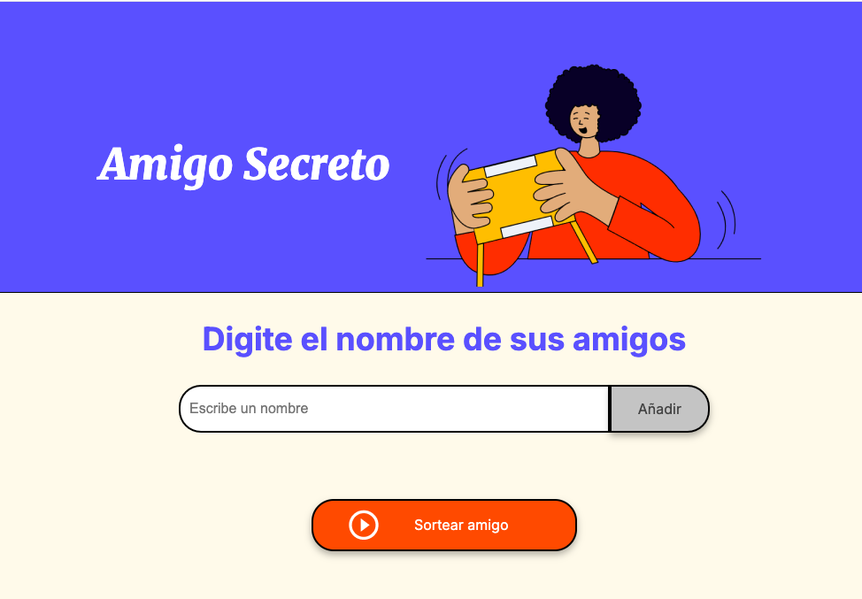

# Título del Proyecto

Aplicación para sortear Nombres de Amigos al Azar. Encuentra a tu Amigo Secreto al azar de una lista.

## Objetivos 
Desarrollar una aplicación web interactiva que permita a los usuarios:
- Configurar el número de amigos participantes.
- Agregar nombres válidos (sin números).\n- Seleccionar aleatoriamente un ganador.
- Reintentar la selección del ganador o reiniciar el juego desde cero.

## Resumen del Proyecto
El **Juego de Amigos** es una herramienta interactiva creada con HTML, CSS y JavaScript puro, diseñada para elegir de forma aleatoria un ganador de una lista de amigos proporcionada por el usuario. Incluye validaciones para garantizar que los nombres sean válidos (sin números) y ofrece una experiencia intuitiva y sencilla.

### Características Principales:
1. Configuración previa del número máximo de amigos.
2. Validación para evitar nombres con números.
3. Elección aleatoria de un ganador.
4. Posibilidad de reintentar o reiniciar el juego.
5. Diseño responsivo y fácil de usar.

### Pre-requisitos 📋

- Tener un navegador compatible como: Brave, Chrome, Safari, Edge.
- Habilitar las opciones de Java Script en el navegador.
- Estar familiarizado con lenguasjes HTML, CSS y Javascript.

### Instalación 🔧

No es necesatio una instalación de alguna herramienta aidcional.

## Despliegue 📦

Es requerido que se tenga conocimientos en VSCode, GitHub y en el lenguaje de programación JavaScript.

## Construido con 🛠️

**HTML5**: Estructura del contenido.
**CSS3**: Estilo y diseño responsivo.
**JavaScript (Vanilla)**: Lógica y funcionalidad interactiva.

## Contribuyendo 🖇️

Si deseas contribuir, ¡no dudes en hacer un pull request!

## Versionado 📌

Usamos [SemVer](http://semver.org/) para el versionado.

## Autor ✒️

* **Florentino López** - *Desarrollador Principal* - [TinusLopez](https://github.com/TinusLopez)

También puedes mirar la lista de todos los [contribuyentes](https://github.com/your/project/contributors) quíenes han participado en este proyecto. 

## Licencia 📄

Este proyecto está licenciado bajo la [MIT License](https://opensource.org/licenses/MIT).

## Expresiones de Gratitud 🎁

* Comenta a otros sobre este proyecto 📢
* Invita una cerveza 🍺 o un café ☕ a alguien del equipo. 
* Da las gracias públicamente 🤓.
* ¡Gracias por usar el Juego de Amigos!
* Si tienes sugerencias o encuentras problemas, abre un issue en el repositorio.

---
⌨️ con ❤️ por [TinusLopez](https://github.com/TinusLopez) 😊